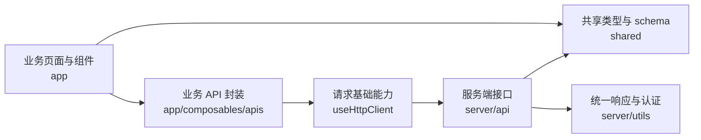

如果你已经开始接入项目，这一页的目的不是解释 Nuva 内部怎么实现，而是帮你判断：遇到请求、接口、共享 schema 或页面开发时，应该去哪里改。

## 一张图先看懂

## 你在项目里最常接触的部分

- `app`：写页面、组件、交互和前端 API 调用。
- `server`：写服务端接口和服务端辅助逻辑。
- `shared`：写前后端共用的类型、schema 和协议定义。

## 什么时候会改到底层配置

只有在这些场景下，你通常才需要继续往下看：

- 你的接口协议和默认响应格式不一致。
- 你要接入登录态、401 跳转或 Better Auth。
- 你要修改运行时配置或 Nuxt 模块行为。

## 阅读建议

- 想知道业务代码放哪里：看 [项目结构](/getting-started/project-structure)。
- 想调整接口配置：看 [请求体系](/request)。
- 想接登录与路由保护：看 [认证与权限](/auth)。
- 想开始写接口与表单：看 [业务实现](/implementation)。
