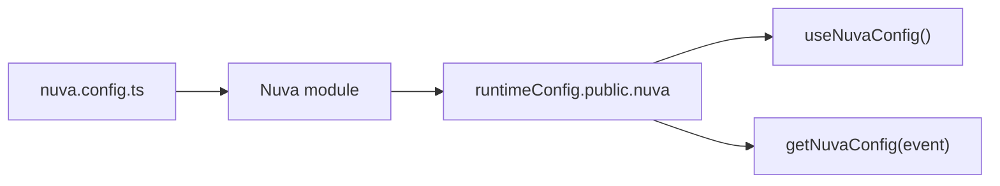

Nuva 的配置分两层：业务领域配置写在 `nuva.config.ts`，Nuxt 运行时配置最终落到 `runtimeConfig.public.nuva`。

## 最小 Nuxt 配置

```ts
// nuxt.config.ts
export default defineNuxtConfig({
  extends: ['@oevery/nuva'],
})
```

启用 Auth core 时再添加模块：

```ts
export default defineNuxtConfig({
  extends: ['@oevery/nuva'],
  modules: ['@oevery/nuva/auth'],
})
```

启用 Better Auth adapter 时使用：

```ts
export default defineNuxtConfig({
  extends: ['@oevery/nuva'],
  modules: ['@oevery/nuva/better-auth'],
})
```

## 最小 Nuva 配置

```ts
// nuva.config.ts
import { defineNuvaConfig } from '@oevery/nuva/config'

export default defineNuvaConfig({
  api: {
    baseURL: '/api',
    envelopeUnwrap: true,
    successCodes: '0,200,SUCCESS',
  },
  auth: {
    provider: 'token',
    loginPath: '/login',
    homePath: '/',
    global: true,
    publicRoutes: ['/login'],
  },
})
```

## 配置流向



客户端和通用运行时读取 `useNuvaConfig()`；服务端已有 `event` 时读取 `getNuvaConfig(event)`。

## 先改哪些配置

第一次接入通常只需要确认：

- `api.baseURL`：业务 API 基础地址。
- `api.envelopeUnwrap`：是否自动解包 `{ code, message, data }`。
- `api.successCodes`：哪些业务 code 代表成功。
- `auth.loginPath`：登录页路径。
- `auth.global` 和 `auth.publicRoutes`：页面保护策略。

完整字段见 [Nuva Config 参考](/reference/nuva-config) 和 [Runtime Config 参考](/reference/runtime-config)。
