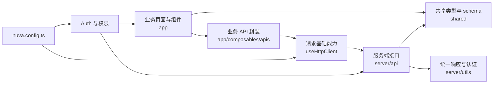

Nuva 的架构目标是让业务代码各归各位：页面负责展示和交互，业务 API 负责请求封装，server API 负责后端逻辑，shared 负责协议和校验。

## 一张图先看懂

## 你最常接触的部分

- `app`：写页面、组件、交互和前端 API 调用。
- `server`：写服务端接口和服务端辅助逻辑。
- `shared`：写前后端共用的类型、schema 和协议定义。
- `nuva.config.ts`：配置 Nuva 请求、认证、权限和远程 resolver。

## Nuva 提供的部分

- Nuxt layer 入口。
- 请求配置、响应处理、token 注入和默认 hooks。
- Auth core、登录跳转、路由保护、权限判断和菜单过滤。
- Better Auth 可选 adapter。
- VueUse、Nuxt Icon、Tailwind CSS 等常用基础能力。

## 业务项目负责的部分

- 真实页面和组件。
- 业务接口实现。
- 业务 API composable。
- 真实登录接口或 Better Auth 实例。
- 业务 schema、表单字段和权限点。

## 什么时候需要看内部实现

大多数业务开发不需要先理解 `core` 内部实现。只有在这些场景下才需要深入：

- 你的接口协议和默认响应格式不同。
- 你要接入企业 SSO、Auth.js、Supabase 或自研 session。
- 你要调整权限来源、菜单来源或 server adapter。
- 你要发布或维护 `@oevery/nuva` 本身。
