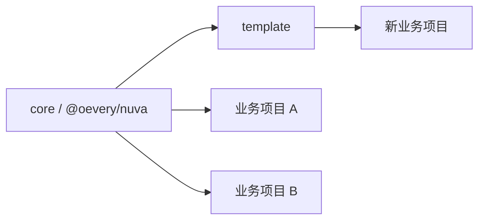

Nuva 同时包含可复用 core layer 和可直接运行的 template。理解这两者的边界，可以避免把业务逻辑写进底层，也避免把底层能力复制到每个项目里。

## `core` 是什么

`core` 发布为 `@oevery/nuva`。它提供：

- Nuxt layer 入口。
- 基础 Nuva module。
- Auth core module。
- Better Auth adapter module。
- HTTP 相关公开工具。
- 配置类型和默认值。
- 服务端 config 与 permission utils。

业务项目通过下面方式继承它：

```ts
export default defineNuxtConfig({
  extends: ['@oevery/nuva'],
})
```

## `template` 是什么

`template` 是业务项目起点。它应该包含真实项目会继续维护的内容：

- `app/pages` 页面。
- `app/components` 业务组件。
- `app/composables/apis` 业务 API 封装。
- `server/api` 服务端接口。
- `shared` 类型和 schema。
- 项目自己的 `nuva.config.ts`。

## 边界原则

- 能被多个项目复用的基础能力，放进 `core`。
- 只属于当前业务项目的页面、接口、schema、权限点，放进项目或 template。
- 认证协议的具体 provider 可以通过 module/adapter 接入，但业务页面仍只消费 Nuva 的统一接口。
- 不要为了一个项目的特殊逻辑修改 core，除非它确实是通用能力。

## 发布与使用关系



`core` 应保持稳定，`template` 应保持可读和可替换。
