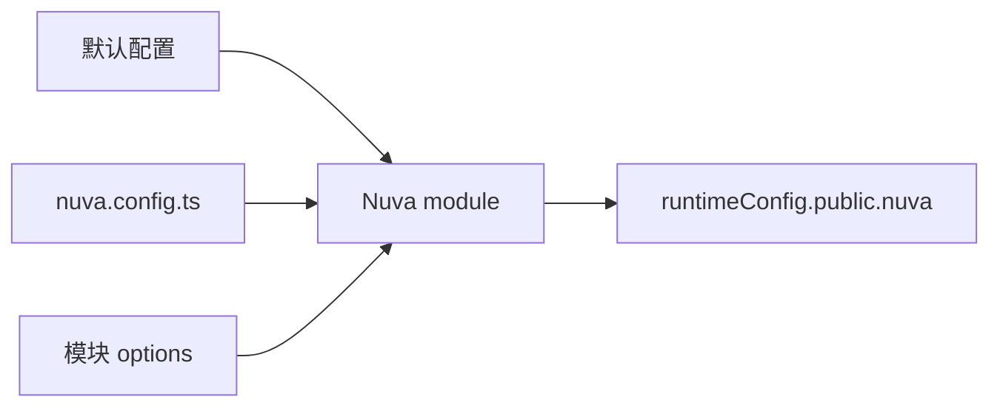

Nuva 把项目配置最终合并到 `runtimeConfig.public.nuva`。这样客户端、SSR 和服务端 API 都能读取同一份可序列化配置。

## 配置来源



默认配置来自 `@oevery/nuva/config`，项目配置通常写在 `nuva.config.ts`。

## 客户端读取

```ts
const nuva = useNuvaConfig()

const apiConfig = nuva.api
const authConfig = nuva.auth
```

## 服务端读取

```ts
import { getNuvaConfig } from '@oevery/nuva/server/utils/config'

export default defineEventHandler((event) => {
  const nuva = getNuvaConfig(event)
  return nuva.auth.loginPath
})
```

服务端读取会把远程请求配置从序列化字符串解析成结构化对象，例如 `auth.permission.remote.request`。

## 为什么远程请求要序列化

`runtimeConfig.public` 必须可序列化。Nuva 会把 `NuvaRemoteRequestConfig` 存成字符串，再在服务端通过 `getNuvaConfig(event)` 解析回来。

## 什么时候直接改 `runtimeConfig`

大多数情况不需要直接改 `runtimeConfig.public.nuva`。优先使用 `nuva.config.ts`，只有在部署平台需要环境覆盖时再考虑 runtime config。

完整字段见 [Runtime Config 参考](/reference/runtime-config)。
